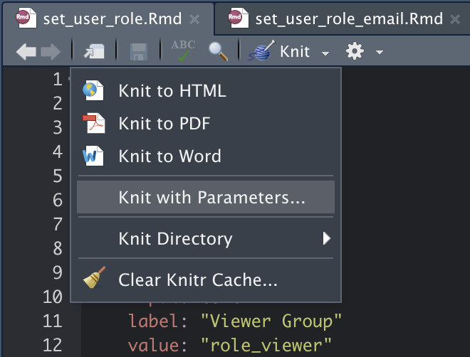

Connect User Management
============================

The RStudio Connect Server API has endpoints to manage
users and groups.

This repository houses some examples that might be useful in
your organization.

- [Email that Reports New Users on RStudio Connect](./email_new_users.Rmd)
    - Configurable "lookback" period
    - Checks if any users were created within the last X days (i.e. last day)
    - Shows the data for those users
    - Sends an email with the user, email, and created time
  
- [Report that Sets User Roles based on Group Membership](./set_user_role.Rmd)
    - Configurable group names mapped to roles (`viewer`, `publisher`, `administrator`)
    - Groups must already exist on RStudio Connect
    - **NOTE: Has a `run_report` parameter that defaults to FALSE!!**
        - This report might change user authorization on your server
        - Be sure you understand what is happening before you run it!
    - **NOTE: Does not work for LDAP Authentication due to current API limitations**
        - Please let us know if you want to use something like this for LDAP Authentication!
        - It just requires getting group memberships directly from LDAP
    - Sends an email with information about the users whose role was changed
    - To run interactively, you can use "Knit with Parameters"

{width=400px}\
